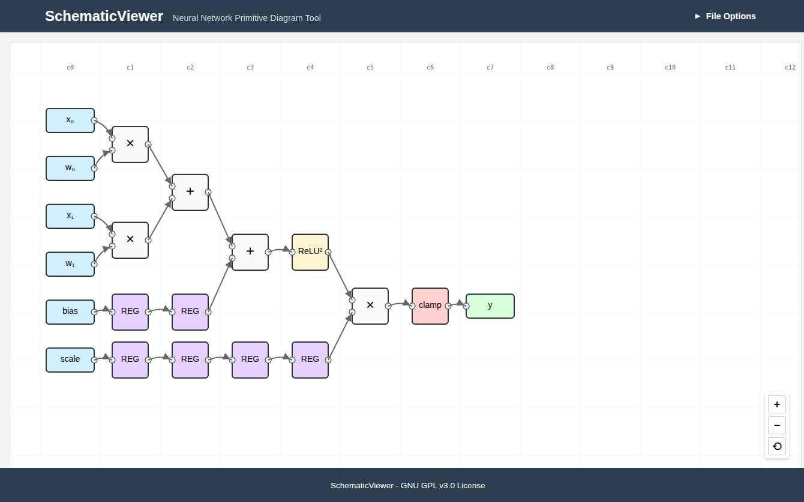

# NNCircuit

A web-based tool for creating and visualizing low-level schematic diagrams of neural network components. Co-developed with [Claude](https://claude.ai), an AI assistant by Anthropic.

## Overview

NNCircuit renders interactive diagrams defined in a hierarchical JSON format using D3.js, providing a clean, circuit-style visualization of neural network internals with module-based organization and clock cycle timing visualization.

**Note:** This project is a work in progress. See the [Status Updates](design_docs/status/) for upcoming features and development status.



## Try it Online

You can try NNCircuit online at: https://bblodget.github.io/nn_viewer/

For a quick demo:
1. Download one of the sample JSON files from the [/json](json/) directory:
   - [primitives_only.json](json/primitives_only.json) - Simple primitives diagram
   - [mac_block.json](json/mac_block.json) - Advanced module-based diagram
2. Drag and drop the file into the online viewer
3. Explore the neural network component visualization

## Features

- **Hierarchical Module System**: Define reusable modules with parameterization
- **Parameter System**: Configure modules with dynamic sizing and values
- **Component Loops**: Generate repetitive structures efficiently
- **Port Groups**: Organize related signals with custom arrangements
- **Multi-bit Signals**: Support for buses with indexing capabilities
- **Clock Cycle Grid**: Visualize timing with automatic component positioning
- **Expression Evaluation**: Dynamic values using parameter expressions
- **Module Navigation**: Drill down into modules to view internal structure
- **Compression Mode**: Toggle between full and compact module display
- **Interactive Visualization**: Pan, zoom, and inspect components
- **Automatic Layout**: Positions determined by data flow and clock cycle
- **Connection Highlighting**: Click on components to highlight data paths
- **Drag & Drop Interface**: Easily load diagram files

## Usage

1. **Open the Application**: Open `index.html` in a web browser (or use the [online version](https://bblodget.github.io/nn_viewer/))
2. **Load a Diagram**: Either:
   - Click the "File Options" button and select a JSON file
   - Drag and drop a JSON file anywhere onto the diagram area
   - Use the included sample files in the [/json](json/) directory to get started
3. **Interact with the Diagram**:
   - Zoom: Mouse wheel or zoom buttons (+/-)
   - Pan: Click and drag on the background
   - Select: Click on components to highlight their connections
   - Navigate Modules: Double-click on modules to view internal structure
   - Return to Parent: Use the back button or breadcrumbs
   - Toggle Compression: Switch between full and compressed views
   - Reset View: Double-click on background or click the reset button (⟲)

## Diagram Format (V2)

NNCircuit uses a hierarchical JSON format with modules, primitives, and parameterization:

```json
{
  "entryPointModule": "mainDiagram",
  "moduleDefinitions": {
    "module1": {
      "is_primitive": false,
      "parameters": {
        "DATA_WIDTH": 8,
        "PAIRS": 2
      },
      "inputs": [
        {"name": "inputName1", "size": "${DATA_WIDTH}", "group": "group1"},
        {"name": "inputName2", "size": "${DATA_WIDTH}", "group": "group1"}
      ],
      "outputs": [
        {"name": "outputName1", "size": 1}
      ],
      "port_groups": {
        "group1": {
          "ports": ["inputName1", "inputName2"],
          "arrangement": "interleaved"
        }
      },
      "components": [
        { "id": "component1", "type": "add", "inputs": { "in1": "$.inputName1", "in2": "$.inputName2" } }
      ],
      "outputMappings": {
        "outputName1": "component1.out"
      },
      "display": {
        "height": 2,
        "color": "#2196F3",
        "label": "Custom Module (${PAIRS}x)"
      }
    }
  },
  "primitiveDefinitions": {
    "add": {
      "is_primitive": true,
      "latency": 1,
      "inputs": [
        {"name": "in1", "size": 1},
        {"name": "in2", "size": 1}
      ],
      "outputs": [
        {"name": "out", "size": 1}
      ],
      "display": {
        "symbol": "+",
        "color": "#4CAF50",
        "shape": "circle"
      }
    }
  }
}
```

The diagram is defined with these key elements:
- `entryPointModule`: Specifies the initial module to display
- `moduleDefinitions`: Contains reusable module templates
- `primitiveDefinitions`: Defines primitive component types (optional)
- `components`: Internal components within a module
- `component_loops`: Templates for generating repetitive components
- `parameters`: Configurable values that can be referenced elsewhere
- `port_groups`: Grouping and arrangement of related ports

For detailed format documentation, see:
- [Diagram Format V2](design_docs/diagram_format_v2.md)
- [Requirements](design_docs/requirements.md)

## Supported Component Types

### Primitives

| Type | Description | Input Ports | Output Ports | Latency |
|------|-------------|-------------|--------------|---------|
| `input` | Input signal | None | `out` | 0 |
| `output` | Output value | `in` | None | 0 |
| `add` | Addition operation | `in1`, `in2` | `out` | 1 |
| `mul` | Multiplication operation | `in1`, `in2` | `out` | 1 |
| `relu2` | Square of ReLU activation | `in` | `out` | 1 |
| `clamp` | Range limiter | `in` | `out` | 1 |
| `reg` | Register for clock cycle delay | `in` | `out` | 1 |

### Modules

NNCircuit supports hierarchical modules - reusable components that encapsulate primitives and other modules:

- **Unified Component Model**: Primitives and modules share a common instantiation interface
- **Parameterization**: Modules can have configurable parameters with expression support
- **Port Grouping**: Related ports can be grouped for organization and layout control
- **Dynamic Component Generation**: Loops can generate repetitive components
- **Automatic Layout**: Components positioned based on clock cycle timing
- **Module Navigation**: Drill down and up through the module hierarchy

## Installation

No installation required! This is a pure HTML/JavaScript application that runs directly in the browser.

1. Clone the repository
2. Open `index.html` in a web browser
3. Start visualizing neural network diagrams!

## Implementation Details

- **Frontend**: HTML, CSS, JavaScript
- **Visualization**: D3.js for SVG-based rendering
- **Expression Evaluation**: Safe evaluation of parameter expressions
- **Clock Cycle Grid**: Visualization of component timing
- **Module Registry**: Central storage of module and primitive definitions
- **Automatic Layout**: Positioning based on data flow and clock cycles

## Development

NNCircuit was co-developed with [Claude](https://claude.ai), utilizing Claude Code for AI pair programming. The development process involved collaborative coding, design discussions, and iterative refinement with Claude providing implementation suggestions and helping solve technical challenges.

To modify or extend NNCircuit:

1. Edit the HTML/CSS for layout and styling
2. Modify `viewer.js` for visualization logic
3. Test by opening `index.html` in a web browser
4. Use browser dev tools for debugging

See the [Status Updates](design_docs/status/) for the current development status.

## Project Status

NNCircuit is currently being rewritten to support the v2 format. The implementation will follow the phases outlined in the [latest status update](design_docs/status/status_2025_05_15.md):

1. **Core Architecture**: Module/primitive registry, parameter resolution, basic rendering
2. **Advanced Features**: Port groups, component loops, module navigation
3. **Layout and Visualization**: Clock cycle positioning, compression mode, visual customization
4. **User Interface**: Navigation controls, compression toggle, zooming and panning

## License

Copyright (C) 2025 Brandon Blodget

This project is licensed under the GNU General Public License v3.0 - see the [LICENSE](LICENSE) file for details. The full text of the license is available in the [gpl-3.0.md](gpl-3.0.md) file.