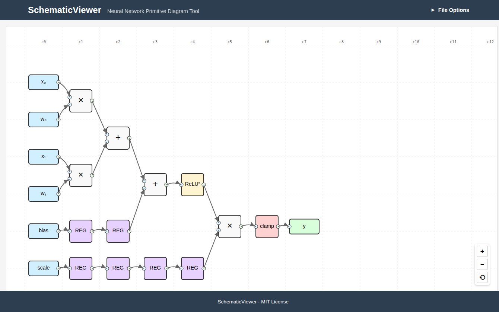

# SchematicViewer

A web-based tool for creating and visualizing low-level schematic diagrams of neural network components. 

## Overview

SchematicViewer renders interactive diagrams defined in JSON netlist format using D3.js, providing a clean, schematic-style visualization of neural network internals.



## Features

- **Interactive Visualization**: Pan, zoom, and inspect individual components
- **Automatic Layout**: Positions are determined based on connections and dependencies 
- **Clock Cycle Alignment**: Components are automatically arranged in temporal order
- **Multiple Component Types**: Support for common neural network primitives
- **Connection Highlighting**: Click on components to highlight data paths
- **Drag & Drop Interface**: Easily load diagram files via drag and drop

## Usage

1. **Open the Application**: Open `index.html` in a web browser
2. **Load a Diagram**: Either:
   - Click the "File Options" button and select a JSON file
   - Drag and drop a JSON file anywhere onto the diagram area
3. **Interact with the Diagram**:
   - Zoom: Mouse wheel or zoom buttons (+/-)
   - Pan: Click and drag on the background
   - Select: Click on components to highlight their connections
   - Reset View: Double-click or click the reset button (⟲)

## Diagram Format

SchematicViewer uses a simplified JSON format that automatically positions components based on their connections:

```json
[
  {
    "id": "x0",
    "type": "input",
    "label": "x₀"
  },
  {
    "id": "mul1",
    "type": "mul",
    "inputs": {
      "in1": "x0.out",
      "in2": "w0.out"
    }
  },
  {
    "id": "output1",
    "type": "output",
    "label": "y",
    "inputs": {
      "in": "mul1.out"
    }
  }
]
```

The diagram is defined as an array of primitives, where:
- Components are positioned automatically based on their connections
- Input primitives are always in cycle 0
- Other primitives are positioned at (max input cycle + 1)
- Vertical ordering is determined intelligently based on connection patterns

For detailed format documentation, see [Diagram Format](design_docs/diagram_format.md).

## Supported Component Types

| Type | Description | Input Ports | Output Ports |
|------|-------------|-------------|--------------|
| `input` | Input signal | None | `out` |
| `output` | Output value | `in` | None |
| `add` | Addition operation | `in1`, `in2` | `out` |
| `mul` | Multiplication operation | `in1`, `in2` | `out` |
| `relu2` | Square of ReLU activation | `in` | `out` |
| `clamp` | Range limiter | `in` | `out` |
| `reg` | Register for clock cycle delay | `in` | `out` |

## Installation

No installation required! This is a pure HTML/JavaScript application that runs directly in the browser.

1. Clone the repository
2. Open `index.html` in a web browser
3. Start visualizing neural network diagrams!

## Implementation Details

- **Frontend**: HTML, CSS, JavaScript
- **Visualization**: D3.js for SVG-based rendering
- **Interaction**: Zoom, pan, selection capabilities
- **Layout**: Automatic positioning based on dataflow dependencies

## Development

To modify or extend the SchematicViewer:

1. Edit the HTML/CSS for layout and styling
2. Modify `viewer.js` for visualization logic
3. Test by opening `index.html` in a web browser
4. Use browser dev tools for debugging

See [Implementation Plan](design_docs/implementation_plan.md) for the planned development roadmap.

## License

This project is licensed under the GNU General Public License v3.0 - see the [LICENSE](LICENSE) file for details.