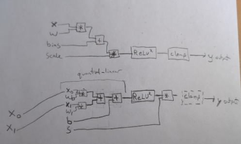

# NNCircuit: Interactive Neural Network Diagram Tool

## Reference Diagram

Here is a hand-drawn example that this project aims to replicate:

## Overview

**NNCircuit** is a web-based tool for creating and visualizing **low-level schematic diagrams** of neural network components (e.g., quantized linear layers, ReLU² activations, clamps, etc.). It allows users to define diagrams using a **hierarchical JSON format** and view them interactively in the browser with support for **panning, zooming, module navigation, and node-level inspection**.

The tool is inspired by hand-drawn schematics and is intended to show what's happening **inside a neural network node**, including individual operations like multiplication, addition, and nonlinear activations.

---

## Goals

- ✅ Create clean, schematic-style visualizations of neural network internals
- ✅ Define circuits using a **hierarchical JSON format** with module reuse
- ✅ View the schematic in any modern **web browser**
- ✅ Support **zooming, panning, and module navigation** for exploring complex diagrams
- ✅ Allow parameterization of components and modules for flexibility
- ✅ Support component loops for generating repetitive structures
- ✅ Enable port grouping and arrangement for better organization
- ✅ Support multi-bit signals with indexing capabilities
- ✅ Visualize clock cycle timing with a grid-based layout system

---

## Requirements

### Input Format

- Input will be provided as a **JSON file** containing:
  - An `entryPointModule` specifying the initial module to display
  - `moduleDefinitions` containing reusable module templates
  - Optional `primitiveDefinitions` for custom primitive components
  - A unified component model for primitives and modules

### Primitive Types

Supported primitive types include:
- `add`: Addition operation with two inputs
- `mul`: Multiplication operation with two inputs
- `relu2`: Square of ReLU activation
- `clamp`: Range limiter
- `reg`: Register (for delay/pipeline stages)

### Module System

- Hierarchical organization with modules containing components
- Component instantiation with parameters and input mappings
- Module outputs connected via output mappings
- Parameterization for dynamic sizing and configuration
- Component loops for generating repetitive structures
- Port groups for organizing related signals
- Support for multi-bit signals with indexing

### Grid and Timing System

- Components positioned on a grid-based layout system
- Clock cycle counts displayed at the top of the grid
- Horizontal position (column) determined by clock cycle
- Vertical position (row) determined by signal flow and organization
- Each clock cycle boundary clearly delineated in the visualization
- Primitives specify their `latency` (clock cycle count), allowing:
  - Input and output primitives have zero latency (no cycle delay)
  - Processing primitives (add, mul, etc.) have configurable latency (default: 1)
  - Register primitives always have latency of 1
- Module latency automatically calculated based on internal component paths
- Width of modules determined by their overall latency (clock cycle count)
- Components within a module aligned to appropriate clock cycle columns

### Web-Based Viewer

- Implemented using **D3.js**
- Render nodes as SVG blocks with appropriate styling
- Draw connections as lines with arrows and signal type indication
- Enable **zoom and pan** using `d3.zoom()`
- Support module navigation (drill-down and up)
- Implement compression mode toggle
- Parameter substitution and expression evaluation
- Visualize clock cycle boundaries and timing

---

## Non-Goals

- Not focused on simulating computation or executing models
- Not intended to replace full circuit editors like KiCAD or Verilog IDEs

---

## Future Enhancements

- Tooltip or click-to-inspect node metadata
- Color-code node types for readability (implemented in v2)
- Export diagrams as SVG or PNG
- Optional animation for signal flow
- Enhanced expression evaluation capabilities
- Parameter scope inheritance from parent to child modules
- Visual indicators for multi-bit signals
- Critical path highlighting

---

## Deliverables

- `index.html` — the D3-based viewer
- `viewer.js` — renderer script implementing the v2 format
- Sample JSON files demonstrating the new format
- CSS styling for clean schematic look

---

## License

This tool is open-source under the GPL-3.0 License.

## JSON Format Requirements (V2)

- **Root Structure**:
  - Must define `entryPointModule` to specify initial view
  - Must include `moduleDefinitions` object with at least one module
  - May include `primitiveDefinitions` for custom primitives

- **Module Definition**:
  - Must include `inputs` and `outputs` arrays with port definitions
  - Should include `components` array or `component_loops` for content
  - Must define `outputMappings` to connect internal components to outputs
  - May include `parameters` for configurable values
  - May include `port_groups` for organizing related ports
  - May include `display` properties for visual customization

- **Primitive Definition**:
  - Must be marked with `is_primitive: true`
  - Must include `inputs` and `outputs` arrays with port definitions
  - Should include `latency` field specifying clock cycle count (default: 1)
  - Input/output primitives should specify `latency: 0`
  - May include `display` properties for visual representation

- **Component Instantiation**:
  - Must include `id` (unique within module) and `type`
  - Must include `inputs` object mapping component inputs to sources
  - May include `parameters` to override default values
  - May include `label` to override default display label

- **Connection References**:
  - Internal component references: `"componentId.portName"`
  - Module input references: `"$.inputName"`
  - Indexed port references: `"componentId.portName[index]"` or `"$.inputName[index]"`

- **Parameter Substitution**:
  - Use `${PARAM_NAME}` syntax to reference parameters
  - Parameters can be used in port sizes, labels, and other fields
  - Support for expressions within `${...}` for dynamic values

- **Component Loops**:
  - Define `iterator`, `range`, and `components` for repetitive structures
  - Use `${iterator}` in expressions for dynamic values
  - Ensure generated component IDs are unique

- **Display Properties**:
  - Module height can be specified, width is determined by latency
  - Color and label properties for visual customization
  - Compression mode for minimal width display

- **Layout and Timing**:
  - Clock cycle grid visualized with column boundaries
  - Components positioned horizontally based on their clock cycle
  - Input primitives always placed in cycle 0
  - Component cycle position = max(input cycles) + component latency
  - Module width determined by longest path from input to output